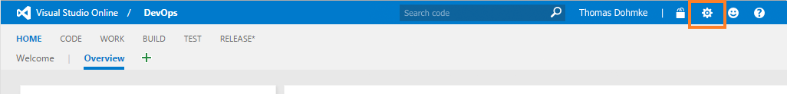
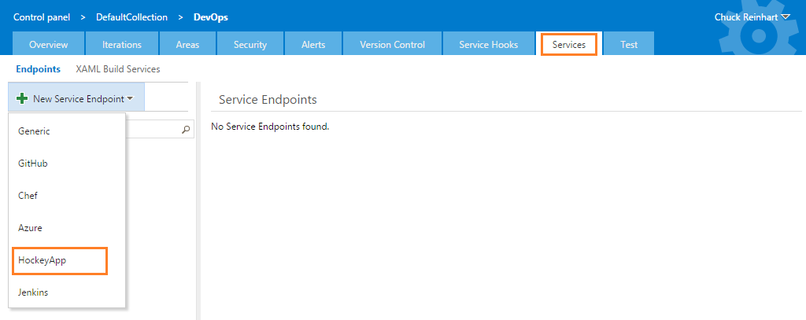

The world's best mobile developers rely on HockeyApp to develop the world’s best apps.  With the HockeyApp extension you can now integrate your existing agile and DevOps workflows with HockeyApp to easily manage distribution of your mobile apps, collect feedback from your users, and respond to crashes.  HockeyApp allows you to get crash reports and feedback from apps at all stages of development and even after being released through the store.  

Take advantage of the Visual Studio Team Services cloud based build capabilities to build your Windows app, and upload that build to HockeyApp as part of your continuous integration flow.  This allows you to distribute builds to your beta testers with each successful continuous integration build, and your beta testers will get automatic updates within the app.  With HockeyApp and Visual Studio Team Services your beta testers will always have the latest app, and your developers will always have the latest feedback and crash reports.  

## Usage

This extension installs the following components:
* A service endpoint for connecting to HockeyApp
* A build task to deploy your app to HockeyApp

To deploy your app to HockeyApp you must create a service endpoint, and then use the build task to deploy the app.

#### Create a HockeyApp service endpoint:

1. On the HockeyApp website, go to Account Settings and choose [API Tokens](https://rink.hockeyapp.net/manage/auth_tokens)
2. Copy the details of your access token.
3. Open the Services page in your Visual Studio Team Services  Control Panel.

4. In the New Service Endpoint list, choose HockeyApp.

5. Enter the token and other details to create the service endpoint.

#### Deploy your app to HockeyApp

1. Open your build definition and add the HockeyApp task. The task can be found in the Deploy section of the ADD TASKS dialog.
2. Enter the required parameter values for the HockeyApp task:
	* **HockeyApp Connection**: Choose the service endpoint you created earlier.
	* **App ID**: This identifier is available in the HockeyApp web portal after you create the app. Find more details on creating a new app [here](http://support.hockeyapp.net/kb/app-management-2/how-to-create-a-new-app).
	* **Binary Folder Path**: The folder with \*.appxupload packages to be uploaded\.
